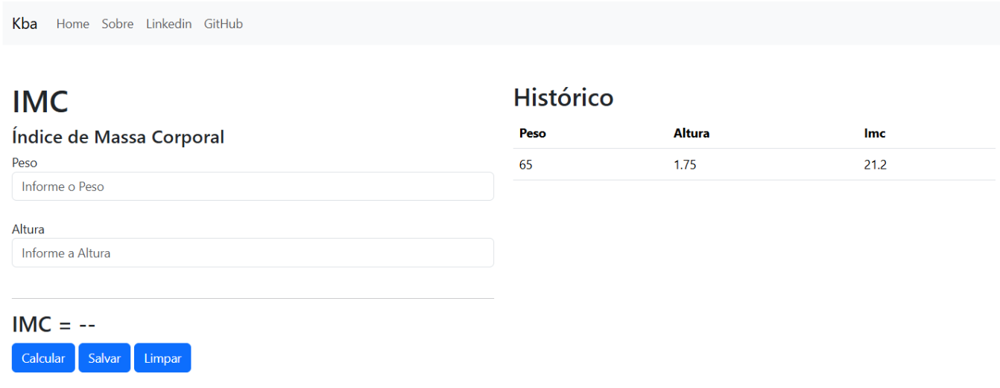

# Calculadora Imc
## Next **React App** & Redux/Toolkit



Acesse o aplicativo: [Calculadora IMC](https://albuquerque-katarine.github.io/next-redux-imc/)

## Objetivo

Desenvolvi uma aplicação para cálculo de IMC utilizando **React, Redux Toolkit, React Router e Bootstrap**. O sistema permite calcular o Índice de Massa Corporal, armazenar resultados em um histórico e gerenciar o estado global da aplicação através do Redux. O projeto foi estruturado com foco em organização de componentes, fluxo de dados e experiência do usuário.

## Funcionalidades

- Cálculo de IMC
- Histórico de registros
- Gerenciamento de estado global
- Navegação entre páginas
- Interface responsiva

## Tecnologias

- React
- Redux Toolkit
- React Router DOM
- Bootstrap
- TypeScript

## Start

**Modo de Desenvolvimento:** ```npm run dev```

## Contatos
- E-mail: [kba.2879@gmail.com](mailTo:kba.2879@gmail.com)
- Linkedin: [/katarine-albuquerque](https://www.linkedin.com/in/katarine-albuquerque/)
